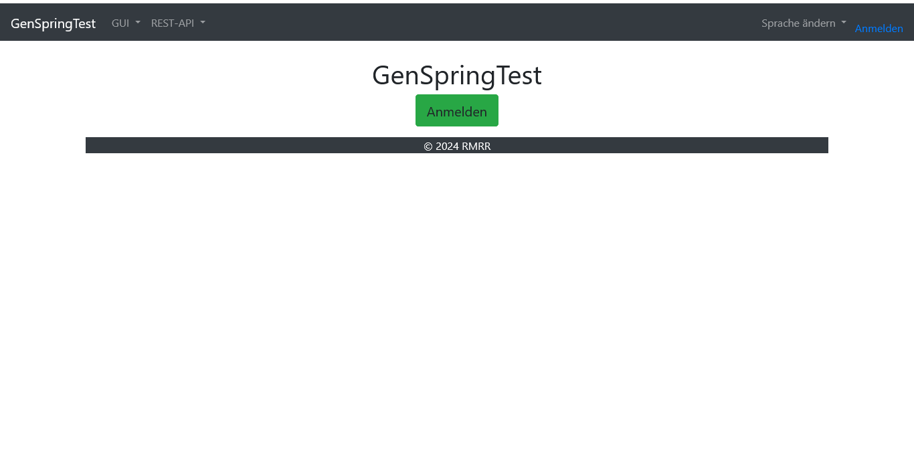
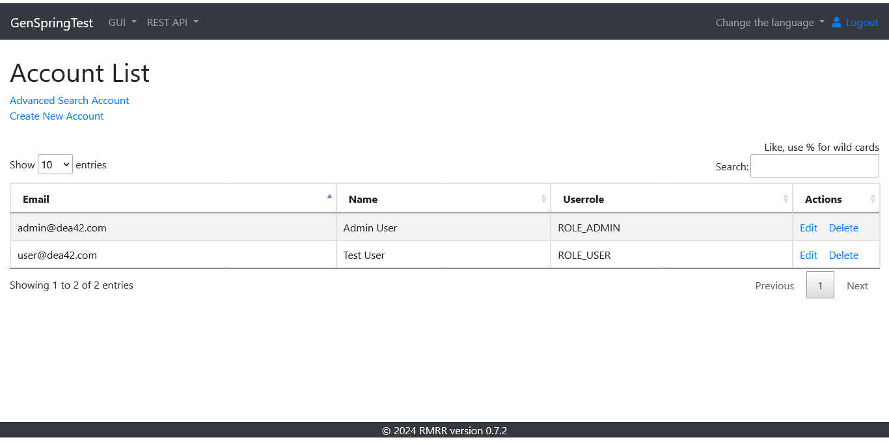
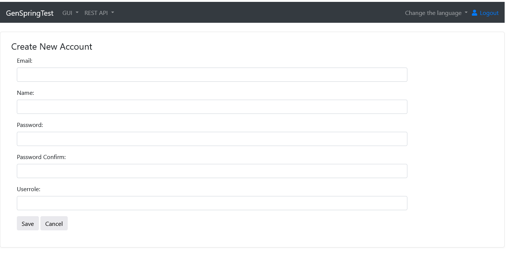
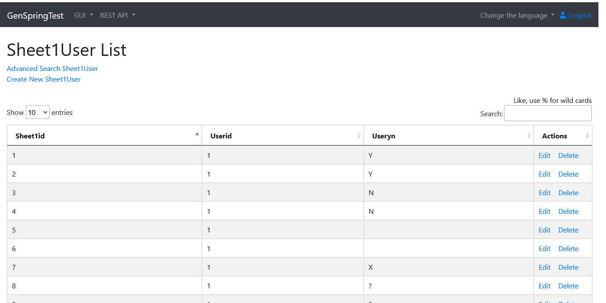
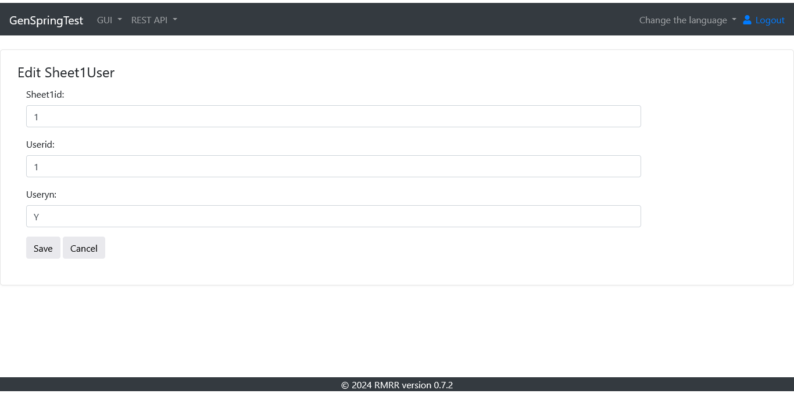
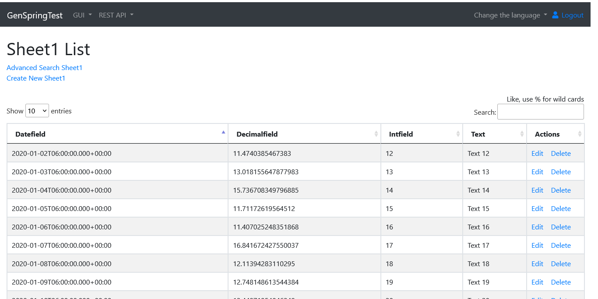
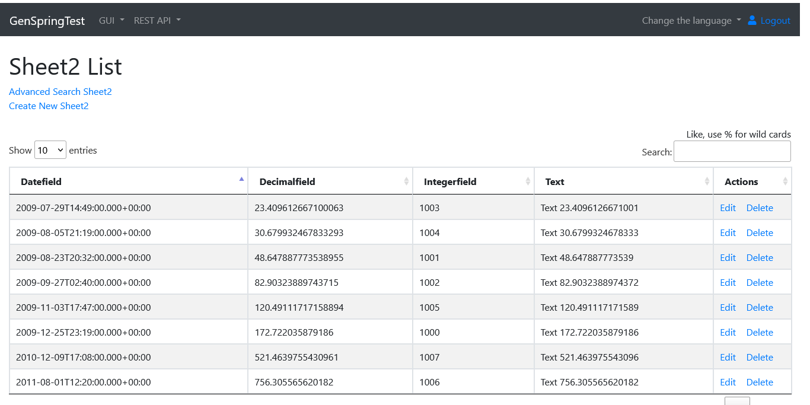
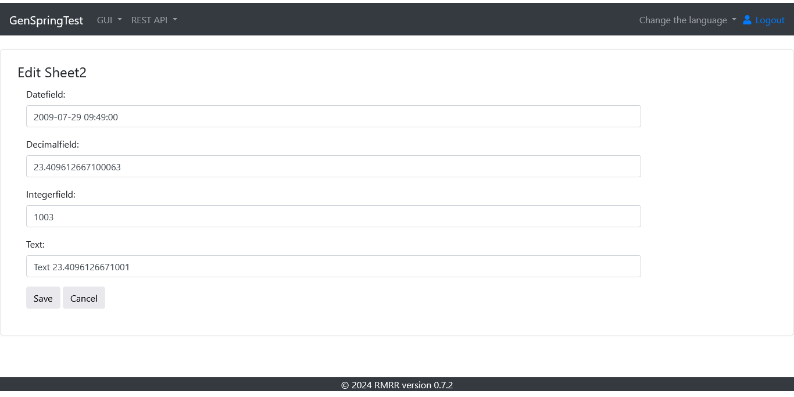

# GenSpringTest
One of the generated apps used to regression test genSpring, prototype changes and use this repo to diff prototype changes. 

[Files list](files.md)

## Screen shots
### Common screens

### Admin screens
#### Account screens

#### Sheet1User screens

#### Sheet1 screens

### User screens
#### Sheet2 screens

